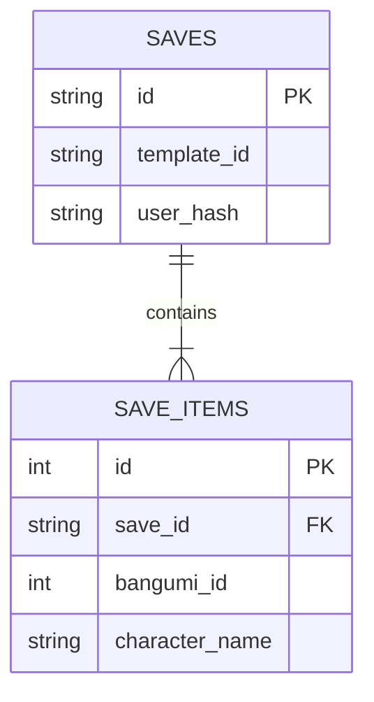

# 🗄️ Database Schema Design

本文档详细解释了 Cloudflare D1 数据库的表结构设计。
**Source of Truth**: `schema.sql`

---

## 1. Tables Overview

| 表名 | 用途 | 关键字段 | 备注 |
| :--- | :--- | :--- | :--- |
| `custom_templates` | 存储 UGC 模版 | `id`, `config` (JSON) | ID 为随机短码 (5位) |
| `saves` | 存储的一份完整填表记录 | `id`, `user_hash`, `template_id` | 主表，记录 Metadata |
| `save_items` | 记录每个格子的填充内容 | `save_id`, `character_name`, `bangumi_id` | 从表，用于细粒度统计 |

---

## 2. Detailed Definition

### 2.1 `custom_templates` (UGC 模版)

用于支持用户“创建模版 -> 生成链接 -> 别人填写”的流程。

*   **`id`** (TEXT PK): 5位随机字母数字组合 (e.g., `Kv9aZ`)。
*   **`type`** (TEXT): 默认为 `grid`。未来支持 `bingo`, `tier`。
*   **`author_ip_hash`** (TEXT): 创建者 IP 的 Hash 值（加盐），用于简单的反滥用/作者识别，不存明文 IP。
*   **`config`** (JSON): 核心配置，包含列数、格子标题数组等。
    *   *Why JSON?* 模版结构灵活多变，JSON 允许我们在不修改数据库结构的情况下支持新特性（如格子特殊颜色、背景图）。

### 2.2 `saves` (存档主表)

当用户点击“生成图片”或“保存”时，记录一次提交。

*   **`id`** (TEXT PK): UUID v4。
*   **`user_hash`** (TEXT): 用户指纹。用于区分 UV (独立访客) 和 PV。
*   **`template_id`** (TEXT): 关联的模版 ID。可以是官方模版 ID (e.g. `2025_general`) 也可以是 UGC 模版 ID。
*   **`device_type`** / **`referer`**: 简单的埋点字段，分析流量来源。

### 2.3 `save_items` (存档明细表 - 用于分析)

**这是“全站热门”统计的数据源。**
我们将每个格子里的填写内容拆解为一行行数据。

*   **`save_id`** (FK): 关联主表。
*   **`slot_label`** (TEXT): 格子标题 (e.g. "最想结婚的角色")。
*   **`character_name`** (TEXT): 填写的角色名。
*   **`bangumi_id`** (INT): Bangumi ID (如有)。**统计排行的核心依据**。
*   **`item_category`** (TEXT): `character` | `subject` | `person`。

---

## 3. Relationships & Indexing

### 索引策略 (Performance)
*   `idx_items_bangumi_id`: **关键索引**。用于 `GROUP BY bangumi_id` 快速计算热门角色。
*   `idx_saves_template`: 用于统计某个模版的热度。
*   `idx_saves_user`: 用于统计用户留存/去重。
