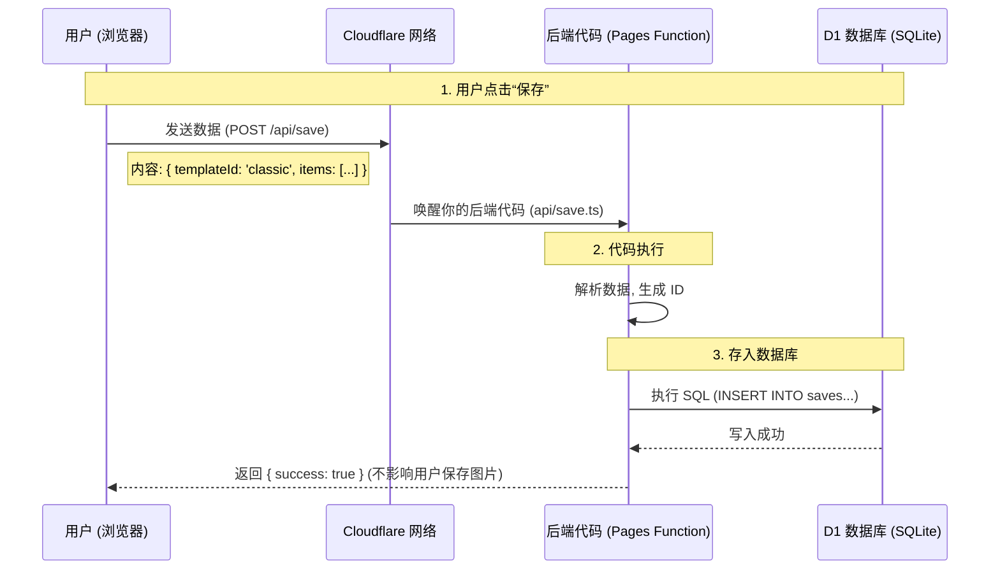

# 数据收集方案：Cloudflare D1 架构详解

## 1. 核心架构图 (Architecture)

这是一个 **Serverless (无服务器)** 架构。你没有租用任何一台物理服务器，所有的代码和数据库都运行在 Cloudflare 的全球边缘网络上。

## 2. 数据存在哪里？(Cloudflare D1)

*   **物理位置**：数据存储在 Cloudflare 的 **D1** 数据库中。D1 是一个基于 **SQLite** 的分布式数据库。
    *   Cloudflare 会自动帮你把数据复制到离你（或你的用户）最近的数据中心，保证读取速度。
    *   你不需要像买阿里云/AWS 那样去管理“一台数据库服务器”，它是纯云端的。
*   **你可以怎么看数据**：
    *   **方法 A (命令行)**：`npx wrangler d1 execute anime-grid-db --command="SELECT * FROM saves"`
    *   **方法 B (网页后台)**：登录 Cloudflare Dashboard -> Workers & Pages -> D1 -> 点击你的数据库 -> **Console** 标签页。你可以在里面像操作 Excel 一样直接从网页上写 SQL 查数据。

## 3. 它是怎么存进去的？(流程详解)

整个过程分为 4 步，完全自动化：

1.  **触发 (Frontend)**：
    *   我们在 `src/App.vue` 里写了一段 `fetch('/api/save', ...)` 代码。
    *   这就好比浏览器给服务器发了一条短信，短信内容是：“用户张三用了经典模板，第一格填了有马加奈”。
2.  **接收 (Function)**：
    *   Cloudflare 收到这条“短信”，立马启动我们在 `functions/api/save.ts` 里写的代码。
    *   这段代码就像一个**速记员**，它甚至不需要专门的服务器一直开着（省钱），有短信来了它才醒过来干活。
3.  **写入 (Database)**：
    *   速记员（Worker）拿着你的“短信”，转身对身后的档案柜（D1 Database）说：“记录一下！”。
    *   它执行了 `INSERT` 语句，把数据把数据永久刻录在硬盘上。
4.  **完成**：
    *   速记员回一句“记好了”，然后立刻去睡觉（停止运行，停止计费）。

## 4. 为什么这么设计？

*   **省钱 (Free Tier)**：这种“醒来-干活-睡觉”的模式（Serverless）非常适合这种偶尔触发的保存操作。如果没人保存，你一分钱都不用花（因为代码没在运行）。
*   **安全**：你的数据库藏在 Cloudflare 内部，外网（黑客）无法直接连接数据库，只有你的 `functions/api/save.ts` 代码有权访问它。
